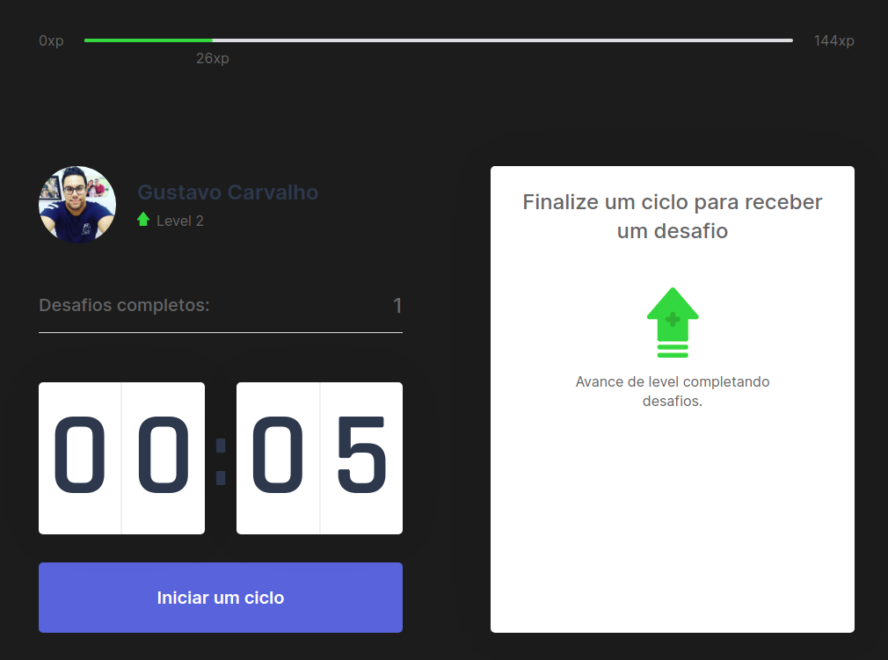

<p align="center">
  
  <a href="https://github.com/gustavocarvalhoti/next-level-week-4/commits/main">
    
  
  </a>
 <br>
  <a href="https://www.linkedin.com/in/gustavocarvalho-ti/">
      
  </a> 
</p>
<strong>
<br>
<p align="center">
  <a href="#bookmark-about">About</a>&nbsp;&nbsp;&nbsp;|&nbsp;&nbsp;&nbsp;
  <a href="#computer-technologies">Technologies</a>&nbsp;&nbsp;&nbsp;|&nbsp;&nbsp;&nbsp;
  <a href="#wrench-tools">Tools</a>&nbsp;&nbsp;&nbsp;|&nbsp;&nbsp;&nbsp;
  <a href="#package-installation">Installation</a>&nbsp;&nbsp;&nbsp;|&nbsp;&nbsp;&nbsp;
  <a href="#memo-license">License</a>
</p>
</strong>
<br>

<p align="center">
    
    
</p>

## :bookmark: About

**move-it** is a platform to improve your quality of life and focus. This project was implemented during the **Next
Level Week #4** of **[Rocketseat](https://rocketseat.com.br/)**.

<br/>
https://moveit-gus-eight.vercel.app/
<br/>

## :computer: Technologies

- **[Typescript](https://www.typescriptlang.org/)**
- **[Node.js](https://nodejs.org/)**
- **[ReactJS](https://reactjs.org/)**
- **[Next.js](https://nextjs.org/)**

<br>

## :wrench: Tools

- **[IntelliJ](https://www.jetbrains.com/)**
- **[Google Chrome](https://www.google.com/chrome/)**

<br>

## :package: Installation

### :heavy_check_mark: **Prerequisites**

The following software must be installed:

- **[Node.js](https://nodejs.org/en/)**
- **[Git](https://git-scm.com/)**
- **[NPM](https://www.npmjs.com/)** or **[Yarn](https://yarnpkg.com/)**

<br>

### :arrow_down: **Cloning the repository**

```sh
  $ git clone https://github.com/gustavocarvalhoti/next-level-week-4.git
```

<br>

### :arrow_forward:    **Running the applications**

- :computer: Web app

```sh
  $ cd server
  # Dependencies install.
  $ yarn # or npm install
  # API start
  $ yarn dev # or npm run dev
```

<br>

## :memo: License

This project is under the **MIT** license.